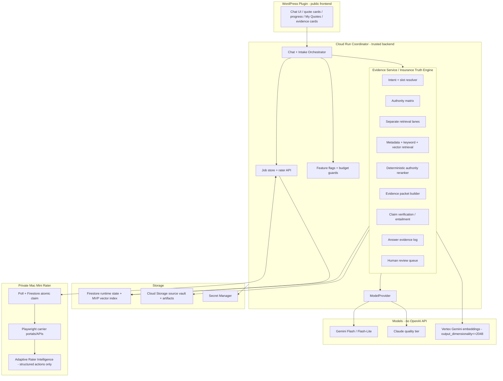

# PolicyGPT AI Architecture Build Plan - MASTER (Reconciled)

**Prepared:** 2026-06-26
**Intended home:** `policygpt-contracts/docs/POLICYGPT_AI_ARCHITECTURE_BUILD_PLAN.md`
**Status:** Build contract / ADR extension. Not production code.
**Provenance:** Single master reconciled from two independently-built plans (Claude's RAG architecture + ChatGPT's session-state-aware build plan), passed through cross-review until both agreed. Best parts of each merged here.
**Format:** plain ASCII (uploads/pastes anywhere).

Legend: **[CONVERGED]** = both models reached this independently (treat as decided). **[FIX]** = defect caught during cross-review. **[FROM-CGPT]** = concrete artifact adopted from ChatGPT's plan. **[FROM-CLAUDE]** = kept from Claude's plan.

---

## 0. CONTROLLING RULE + how Claude Code uses this document

This document is committed into `policygpt-contracts` as the shared AI architecture build contract. Claude Code, Codex, and the repo test gates use it to decide what gets built, deferred, and forbidden.

```text
SOLO-FOUNDER MVP OVERRIDE:
The MVP track below controls implementation timing, cost, and scope. The full RAG
Architecture Report stays the long-term ADR. Where they conflict on TIMING, COST, or
SCOPE, the MVP track wins until post-launch revenue or explicit Josh approval.

Build ONLY the Firestore + Cloud Storage MVP path first. Do NOT implement AlloyDB,
Vertex Vector Search, public web-verification fetching, a paid/ML reranker, BigQuery,
a graph DB, six-state legal automation, or broad crawler promotion until post-launch
revenue or explicit owner approval.

RAG must NOT block the quote/rater MVP (guest mode, quote flow, rater job queue,
quote cards, artifact signing, My Quotes, licensed-agent handoff).
```

**First PR (RAG-M0.5 / Phase AI-0):** contracts + docs only. Do NOT implement Coordinator/plugin/rater runtime in the first PR. Implementation starts after the contracts/docs PR is reviewed and merged.

```text
Repo:   policygpt-contracts
Branch: claude/ai-architecture-build-plan
Author: Claude Code   Reviewer: Codex
Add:    docs/POLICYGPT_AI_ARCHITECTURE_BUILD_PLAN.md  (this file)
        schemas/evidence-answer.schema.json
        schemas/knowledge-context.schema.json
        schemas/crawler-job.schema.json
        schemas/evidence-packet.schema.json      (internal/reference)
Edit:   contracts-README.md       (link this plan; state schemas are additive)
        contracts-openapi.yaml     (additive response refs + discovery-job paths only)
        AGENT_LOOP.md              (paste the RAG-AI task queue, Section 13)
        SESSION_STATE.md           (note the RAG-M0.5 PR)
```

> Confirm BDRDEV1/policygpt-contracts PR #1 (contract reconciliation) is merged, or branch from `claude/contract-reconciliation`. Do not branch RAG contract work off an unreconciled main.

---

## 1. Settled decisions + cross-review fixes

### 1.1 Settled (decided unless Josh overrides) [CONVERGED]

```text
1.  WordPress plugin = public frontend only.
2.  Cloud Run Coordinator = trusted backend.
3.  RAG/Evidence Engine lives inside the Coordinator behind ModelProvider (never WordPress).
4.  Firestore = live runtime state AND the MVP vector store.
5.  Cloud Storage = immutable source/artifact vault.
6.  Secret Manager = cloud secrets; local rater secrets use macOS safeStorage.
7.  Private Mac Mini rater stays private + polling-based (Firestore atomic claim, not Cloud Tasks push).
8.  Source documents are truth; vector indexes are rebuildable search indexes.
9.  The model never browses/retrieves arbitrary docs; the Coordinator builds a deterministic evidence packet first; the model receives only the curated packet + narrow instructions.
10. Authority lanes are separate and deterministic (Section 5).
11. Gemini Flash/Flash-Lite = cheap/high-volume intake + low-risk grounded answers; Claude = coverage-sensitive/policy-specific/conflicting/higher-risk synthesis + verification.
12. Customer-facing copy is provider-neutral (no "Claude says"/"Gemini says"/"Powered by Claude" in answer UI).
13. Public web verification disabled at launch; represented by a stub/review task.
14. Start with ONE profession (real_estate_agent) and ONE state.
15. Do not build around the pending settlement.
16. Additive-only contract changes, versioned major.minor; consumers reject unknown MAJOR.
17. No OpenAI API in the shipped product. No Base44.
```

### 1.2 Cross-review fixes (apply) [FIX]

| # | Defect | Fix | Caught by |
|---|---|---|---|
| F1 | Firestore vector max dimension = **2048**; `gemini-embedding-001` defaults to **3072**. Storing 3072 in Firestore fails. | Set `output_dimensionality` explicitly. **Default 1536** (safe, well under 2048); **benchmark 768** as a cost optimization (re-embedding down is cheap - index is rebuildable). Never store 3072 in Firestore. Store `vector_dim` on every chunk + corpus config. | Both, independently |
| F2 | MVP had no reranker -> authority bleed risk. | **Deterministic rules reranker** (no ML, no new service) - Section 5.2. Part of MVP. | ChatGPT |
| F3 | Cost guardrails implied, not enforced. | Feature flags + budget counters + kill switches as code - Section 9. | ChatGPT |
| F4 | Production target named AlloyDB (always-on cost). | **Cloud SQL + pgvector** is the migration candidate; AlloyDB only at funded/scale phase. | ChatGPT; Claude memo agrees |
| F5 | Customer-policy RAG put full assembly + conflict cards in MVP. | MVP = quote/binder/declarations explanation + page-level citations + **dual-mode incomplete detection**. Keep `policy_assembly_relation` schema but **DEFER runtime assembly**. Deferral is **ACTIVE**: the system announces it cannot fully assemble and stays at quote-stage; it must NEVER answer off a base form while silently ignoring an endorsement. | ChatGPT; Claude adds active-defer safety |
| F6 | "Claude the only model named in customer copy" (old AI_MODEL_MAP.md). | **DECIDED (Josh 2026-06-26):** provider-neutral customer copy. Answer attribution byline = **"Reviewed by PolicyGPT.com Insurance AI Assistant"**. Standing disclaimer = **"AI can make mistakes. Speak with a licensed agent to confirm."** No model names ("Claude"/"Gemini") in customer UI; model names in logs/traces/evals/admin only. **Update AI_MODEL_MAP.md** (Section 17.1). | ChatGPT; Claude adopts; Josh decided |
| F7 | Some pricing cited aggregators (nOps/CloudZero/RankSquire). | Before committing to any provider/service, replace aggregator pricing with **official provider pricing pages**; aggregators are rough commentary, never acceptance criteria. Appendix A pricing is flagged accordingly. | ChatGPT; Claude adopts |
| F8 | Embedding dim not pinned to corpus config. | `vector_dim` required on every chunk + corpus-level config; index build asserts uniform dim and rejects > 2048. | Derived from F1 |

**Required corpus config** [FROM-CGPT]:

```json
{
  "embedding_model": "gemini-embedding-001",
  "embedding_provider": "vertex_ai",
  "vector_dim": 1536,
  "distance_measure": "COSINE",
  "created_at": "2026-06-26T00:00:00Z",
  "corpus_version": "rag-mvp-001"
}
```

---

## 2. Current build state to respect [FROM-CGPT]

```text
Already real:    WP plugin (v1.26.x); Cloud Run Coordinator + intake service; shared contracts; rater + Mac worker design.
Already merged:  M0 contracts (substantially); M1 Firestore session store; M4 worker API/job-store; Firestore atomic claim;
                 /rater/* nonce replay protection; contract validation; completion idempotency by event_id;
                 retryable fail w/ attempt caps; /rater/artifacts/sign as a 501 stub.
Next milestone:  M1.5 questions-as-data intake engine.
Forthcoming:     M2 guest mode + plugin work; Cloud Storage artifact signing; rater MVP; RAG/Evidence Engine.
```

**Build-order implication:** RAG must not block the revenue path (quote flow, guest mode, rater submit/status, signed artifact URLs, quote cards, agent handoff). Build RAG as a clean Coordinator seam supporting: free insurance Q&A, mid-intake educational answers, quote-result explanations, policy/quote document explanations, missing-document detection, agent/legal escalation.

---

## 3. Target architecture



Responsibility boundaries are unchanged from the settled architecture (WP renders; Coordinator orchestrates + owns Evidence Service; Evidence Service does deterministic retrieval/authority/verification but is never the final truth source and never makes pricing/eligibility decisions; Firestore = runtime + MVP index; Cloud Storage = vault; private Mac rater = automation only, never an AI/RAG authority; models synthesize from curated data only, never bind coverage/rate/legal).

---

## 4. MVP physical data architecture (two services) [FROM-CGPT] [CONVERGED]

```text
Cloud Storage = immutable vault for original artifacts + parsed snapshots.
Firestore     = everything else at MVP scale (registry, chunks, vectors, logs, review, flags, budgets).
```

### 4.1 Cloud Storage buckets / folders

```text
gs://policygpt-vault-public/
  guidance/{line}/{profession}/{source_id}/{version_id}/original.pdf
  law/{state}/{source_id}/{version_id}/snapshot.html
  carrier-public/{carrier}/{product}/{source_id}/{version_id}/original.pdf
  parsed/{document_id}/{version_id}/pages.json
  parsed/{document_id}/{version_id}/chunks.json

gs://policygpt-vault-private/
  tenants/{tenant_id}/sessions/{quote_session_id}/uploads/{document_id}/original.pdf
  tenants/{tenant_id}/policy_packages/{policy_package_id}/{document_id}/original.pdf
  tenants/{tenant_id}/jobs/{job_id}/artifacts/{artifact_id}.pdf
  parsed/tenants/{tenant_id}/{document_id}/{version_id}/pages.json

gs://policygpt-web-temp/      # DEFERRED until web-verification broker is built
  snapshots/{source_host}/{snapshot_id}/snapshot.html
```

### 4.2 Firestore collections

```text
/source_documents/{document_id}
/document_versions/{version_id}
/parsed_pages/{page_id}
/evidence_chunks_public/{chunk_id}
/tenants/{tenant_id}/policy_packages/{policy_package_id}/chunks/{chunk_id}   # private chunks NESTED under tenant (ACL-safe by structure)
/policy_assembly_relations/{relation_id}
/evidence_packets/{evidence_packet_id}
/answer_logs/{answer_log_id}
/answer_claims/{claim_id}
/human_review_tasks/{task_id}
/eval_cases/{case_id}
/eval_runs/{run_id}
/feature_flags/global
/budget_counters/{yyyy_mm_dd}
/lines/{line_of_business}/professions/{profession}/questions/{question_id}
/lines/{line_of_business}/professions/{profession}/knowledge_config/current
/discovery_jobs/{discovery_job_id}
/discovery_jobs/{discovery_job_id}/drafts/{draft_id}
```

**ACL-safety note [FROM-CGPT, emphasized]:** private chunks live *under* the tenant path (`/tenants/{tenant_id}/policy_packages/{policy_package_id}/chunks/...`), never in a shared collection. This makes cross-tenant leakage a structural impossibility, not just a query-filter promise. The ACL filter is still applied before retrieval (defense in depth).

Public chunk shape carries: `chunk_id, document_id, version_id, corpus_id, tenant_id:null, visibility:"public", line_of_business, profession, jurisdiction, carrier, product_name, form_number, edition_date, policy_role, source_type, authority_tier, review_status, rights_status, effective_from/to, retrieved_at, as_of_date, page_number, section_path, clause_type, text, defined_terms[], cross_references[], parser_confidence, embedding_model, vector_dim, embedding[], keyword_tokens[], created_at, updated_at`.

Private chunk shape adds: `tenant_id, quote_session_id, policy_package_id, visibility:"tenant_private", review_status:"user_uploaded_unreviewed", storage_uri` and is stored only under the tenant path above.

---

## 5. Authority matrix + retrieval lanes + deterministic reranker

### 5.1 Authority matrix (safety spine) [CONVERGED]

| Question / claim type | Controlling lane | Supporting lanes | Behavior when controlling evidence missing |
|---|---|---|---|
| General PL education | reviewed_guidance | law, carrier_public, sample_prevalence | answer generally; scope=general |
| Carrier/form/endorsement/exclusion | carrier_form | law, guidance | ask for carrier/form/edition; do not generalize across carriers |
| State legal/regulatory | law_regulation | DOI guidance, reviewed guidance | if current text missing/stale -> abstain + route to licensed/legal review |
| Customer quote/binder/declarations | customer_quote_or_binder | rater_result, carrier_form, guidance | mark quote_stage; not final issued-policy coverage |
| Customer issued policy | issued_policy_package | carrier_form, law, guidance | ask for missing decl/forms/endorsements if incomplete; **active-defer if endorsements unassembled (F5)** |
| Comparative quote explanation | rater_result + quote_pdf | carrier_form, guidance | explain deterministic values only; never change price/eligibility/selected rule |
| Intake/rater operational | intake_operational | question_set, rater_status | do not infer coverage from UW/application questions |
| Crawler/live-learned carrier Q | draft_unreviewed | none until reviewed | never cite as authority; route to review |

### 5.2 Deterministic authority reranker [FIX F2] [FROM-CGPT, merged]

Normal Coordinator code (no paid/ML reranker). Sort candidates by:

```text
1. authority_tier score
2. exact identifier match (form_number, endorsement#, statute section, quote_number, policy_package_id)
3. jurisdiction match
4. line_of_business + profession match
5. carrier/product match
6. edition / effective-date / as_of match
7. review_status score
8. policy/quote/session proximity
9. vector distance
10. recency (only AFTER authority + effective-date checks)
```

```ts
function rerankEvidence(candidates, slots, controllingLane) {
  return candidates
    .map(c => ({ candidate: c, score: scoreCandidate(c, slots, controllingLane) }))
    .sort((a, b) => b.score.total - a.score.total)
    .map(x => x.candidate);
}
function scoreCandidate(c, slots, controllingLane) {
  return {
    authority: authorityScore(c.authority_tier, controllingLane),
    exact: exactMatchScore(c, slots),
    jurisdiction: c.jurisdiction === slots.jurisdiction ? 100 : -100,
    lineProfession: (c.line_of_business === slots.line_of_business && c.profession === slots.profession) ? 60 : 0,
    carrierProduct: carrierProductScore(c, slots),
    temporal: effectiveDateScore(c, slots.as_of_date),
    review: reviewStatusScore(c.review_status),
    proximity: sessionProximityScore(c, slots),
    vector: vectorScore(c.distance),
    total: 0 // sum above with weights; authority + exact dominate
  };
}
```

Retrieval lanes: `policy_lane, quote_binder_lane, law_regulation_lane, carrier_form_lane, reviewed_guidance_lane, rater_intake_lane, draft_unreviewed_lane, web_temp_lane (stubbed at MVP)`.

---

## 6. Evidence Answer contract (committable schema) [FROM-CGPT]

Add to `policygpt-contracts` as `schemas/evidence-answer.schema.json`. The plugin renders cards from this.

```json
{
  "$schema": "https://json-schema.org/draft/2020-12/schema",
  "$id": "https://policygpt.com/contracts/evidence-answer.schema.json",
  "title": "PolicyGPT Evidence Answer",
  "description": "Coordinator -> Plugin AI/RAG answer response. Additive contract for evidence-aware chat cards.",
  "type": "object",
  "required": ["schema_version","answer_id","answer","scope","evidence_status","as_of_date","claims","citations"],
  "additionalProperties": true,
  "properties": {
    "schema_version": { "type": "string", "pattern": "^[0-9]+\\.[0-9]+$" },
    "answer_id": { "type": "string" },
    "quote_session_id": { "type": ["string","null"] },
    "job_id": { "type": ["string","null"] },
    "policy_package_id": { "type": ["string","null"] },
    "evidence_packet_id": { "type": ["string","null"] },
    "answer": { "type": "string" },
    "scope": { "enum": ["general","carrier_form","state_law","policy_specific","quote_stage","issued_policy","comparative_quote","intake_operational"] },
    "evidence_status": { "enum": ["verified","supported","incomplete","conflicting","stale","draft_unreviewed","not_authoritative"] },
    "as_of_date": { "type": "string" },
    "authority_lane": { "enum": ["policy","quote_binder","law_regulation","carrier_form","reviewed_guidance","rater_intake","draft_unreviewed","web_temp","none"] },
    "claims": { "type": "array", "items": { "type": "object", "required": ["claim_id","text","support"], "additionalProperties": true,
      "properties": { "claim_id": {"type":"string"}, "text": {"type":"string"}, "support": {"enum":["direct","inferred","unsupported","qualified"]}, "authority_lane": {"type":"string"}, "citation_ids": {"type":"array","items":{"type":"string"}} } } },
    "citations": { "type": "array", "items": { "type": "object", "required": ["citation_id","source_label"], "additionalProperties": true,
      "properties": { "citation_id": {"type":"string"}, "chunk_id": {"type":["string","null"]}, "document_id": {"type":["string","null"]}, "source_label": {"type":"string"}, "page_number": {"type":["integer","null"]}, "section_path": {"type":["string","null"]}, "authority_tier": {"type":["string","null"]}, "source_display": {"type":["string","null"]} } } },
    "missing_information": { "type": "array", "items": { "type": "string" } },
    "conflicts": { "type": "array", "items": { "type": "object", "additionalProperties": true, "properties": { "type": {"type":"string"}, "summary": {"type":"string"}, "citation_ids": {"type":"array","items":{"type":"string"}} } } },
    "requires_agent_review": { "type": "boolean" },
    "requires_legal_review": { "type": "boolean" },
    "requires_policy_document_upload": { "type": "boolean" },
    "needs_web_verification": { "type": "boolean" },
    "web_verification_reason": { "type": ["string","null"] },
    "disclaimer": { "type": "string" },
    "next_action": { "enum": ["continue_intake","show_sources","upload_document","speak_with_agent","answer_carrier_question","none"] }
  }
}
```

**Customer-facing labels** (provider-neutral - F6): `verified`->"Based on your documents"; `supported`->"Based on reviewed sources"; `incomplete`->"I need a bit more to answer fully"; `conflicting`->"Your documents may conflict here" + conflict card + agent CTA; `stale`->"This may have changed recently" + abstain on definitive claim; `draft_unreviewed`->not shown as fact; `not_authoritative`->"I cannot verify that from approved sources" + abstain/agent CTA. No fake confidence percentages.

**Decided branding (Josh 2026-06-26):**
- **Answer attribution byline** (every customer-facing answer card): `Reviewed by PolicyGPT.com Insurance AI Assistant`
- **Standing `disclaimer` string** (default value for the schema `disclaimer` field on coverage/legal/quote answers): `AI can make mistakes. Speak with a licensed agent to confirm.`
- Never name the underlying model ("Claude"/"Gemini") in customer copy. The byline names the product assistant, not the provider, so it stays provider-neutral and model-swappable behind ModelProvider.
- Exact disclaimer wording is flagged for counsel sign-off (Section 17, COUNSEL: disclaimer + escalation language) before public launch.

---

## 7. Knowledge-context + crawler/discovery job contracts [FROM-CGPT] [CONVERGED]

### 7.1 `schemas/knowledge-context.schema.json`

```json
{
  "$schema": "https://json-schema.org/draft/2020-12/schema",
  "$id": "https://policygpt.com/contracts/knowledge-context.schema.json",
  "title": "PolicyGPT Knowledge Context",
  "description": "Optional context used by the Coordinator/Evidence Service to route a session/result to the correct knowledge base. Additive only.",
  "type": "object",
  "required": ["line_of_business","profession"],
  "additionalProperties": true,
  "properties": {
    "line_of_business": {"type":"string"},
    "profession": {"type":"string"},
    "knowledge_base_ref": {"type":["string","null"]},
    "jurisdiction": {"type":["string","null"]},
    "carrier": {"type":["string","null"]},
    "product_name": {"type":["string","null"]},
    "form_number": {"type":["string","null"]},
    "edition_date": {"type":["string","null"]},
    "quote_session_id": {"type":["string","null"]},
    "job_id": {"type":["string","null"]},
    "policy_package_id": {"type":["string","null"]},
    "as_of_date": {"type":["string","null"]}
  }
}
```

Not required in existing quote-job payloads (which already carry `line_of_business`+`profession`). Use as an optional field in future chat/session/completion responses, an internal Evidence Service input type, and documentation of the per-line `knowledge_base_ref` seam.

### 7.2 `schemas/crawler-job.schema.json` (separate from quote-job by design)

Do NOT add `question_set_draft` to the quote-job `fulfillment_mode` enum (it stays `automated | manual`).

```json
{
  "$schema": "https://json-schema.org/draft/2020-12/schema",
  "$id": "https://policygpt.com/contracts/crawler-job.schema.json",
  "title": "PolicyGPT Rater Discovery / Crawler Job",
  "description": "Coordinator -> Rater job for harvesting carrier question-set drafts. Separate from quote-job.schema.json by design.",
  "type": "object",
  "required": ["schema_version","discovery_job_id","job_type","line_of_business","profession","target_carriers","review_required"],
  "additionalProperties": true,
  "properties": {
    "schema_version": {"type":"string","pattern":"^[0-9]+\\.[0-9]+$"},
    "discovery_job_id": {"type":"string"},
    "job_type": {"const":"question_set_discovery"},
    "line_of_business": {"type":"string"},
    "profession": {"type":"string"},
    "jurisdiction": {"type":["string","null"]},
    "target_carriers": {"type":"array","items":{"type":"string"}},
    "seed_answers": {"type":"object","additionalProperties":true},
    "objective": {"enum":["harvest_required_questions","detect_flow_changes","validate_known_question_set"]},
    "review_required": {"const":true},
    "authority_label": {"const":"draft_unreviewed_intake_operational"},
    "requested_by": {"type":["string","null"]},
    "created_at": {"type":"string"}
  }
}
```

**OpenAPI (additive):** add `POST /rater/discovery-jobs/claim`, `/{id}/heartbeat`, `/{id}/question-set-draft`, `/{id}/complete`, `/{id}/fail`. Replace the OpenAPI text describing `fulfillment_mode: "question_set_draft"` with the discovery-job path. Keep the old `/rater/jobs/{job_id}/question-set-draft` only if already implemented, marked deprecated and unused for MVP. The crawler still emits the existing `question-set-draft.schema.json` (`needs_review: true` always).

---

## 8. Evidence Service internal architecture [FROM-CGPT]

```text
src/evidence/
  index.ts  types.ts  evidenceService.ts
  intentClassifier.ts  slotResolver.ts  authorityMatrix.ts  retrievalPolicy.ts
  laneRetrievers/ publicGuidanceRetriever.ts lawRetriever.ts carrierFormRetriever.ts
                  quoteBinderRetriever.ts policyPackageRetriever.ts raterResultRetriever.ts
  keywordSearch.ts  vectorSearch.ts  deterministicReranker.ts
  evidencePacketBuilder.ts  answerVerifier.ts  answerLogger.ts
  reviewTaskService.ts  budgetGuard.ts  featureFlags.ts
```

```ts
export interface EvidenceService {
  resolve(input: ResolveEvidenceInput): Promise<EvidenceResolution>;
  retrieve(input: EvidenceRetrieveInput): Promise<EvidenceCandidateSet>;
  buildPacket(input: BuildEvidencePacketInput): Promise<EvidencePacket>;
  verify(input: VerifyAnswerInput): Promise<VerifiedAnswer>;
  log(input: LogEvidenceAnswerInput): Promise<EvidenceAnswerLog>;
  answer(input: EvidenceAnswerInput): Promise<EvidenceAnswer>;
}
```

**Runtime sequence:** classify intent+risk -> resolve slots (line, profession, state, carrier, product, form, edition, quote_session_id, job_id, policy_package_id, as_of) -> authority matrix picks controlling lane -> retrieval policy picks lanes+filters -> **ACL/tenant scope applied BEFORE retrieval** -> metadata filters before vector search -> keyword retrieval (exact identifiers) -> vector retrieval (explicit `vector_dim`) -> deterministic reranker -> evidence packet -> ModelProvider selects Gemini/Claude by risk+budget guard -> model drafts from packet ONLY -> verification pass strips/qualifies unsupported claims -> answer log saved -> plugin renders card.

**Model routing:** Gemini Flash/Flash-Lite for simple education, intake clarifications, slot extraction, low-risk reviewed-guidance answers, summaries where `supported` and no conflicts. Claude Sonnet for policy-specific, coverage-sensitive quote/binder explanation, conflicting evidence, state-law drafts, high-risk verification, comparative explanations involving documents/forms. NO model for deterministic rater prices, carrier eligibility, selected-carrier rule, binding coverage, legal conclusion without review.

---

## 9. Feature flags, budget caps, kill switches [FIX F3] [FROM-CGPT]

```json
{
  "RAG_ENABLED": true,
  "RAG_PUBLIC_QA_ENABLED": true,
  "RAG_POLICY_UPLOAD_ENABLED": false,
  "RAG_QUOTE_EXPLANATION_ENABLED": true,
  "WEB_VERIFY_ENABLED": false,
  "CLAUDE_HIGH_RISK_ONLY": true,
  "PAID_RERANKER_ENABLED": false,
  "DISCOVERY_CRAWLER_ENABLED": false,
  "PUBLIC_LEGAL_ANSWERS_ENABLED": false
}
```

Budget counters: `model_calls_by_provider_by_day, input_tokens_by_provider_by_day, output_tokens_by_provider_by_day, embedding_tokens_by_day, rag_answers_by_scope_by_day, claude_high_risk_calls_by_day, web_verify_requests_by_day`. Controls: daily + monthly model-spend alerts; per-session free-question limit; per-IP abuse throttling; per-session high-risk Claude cap; fallback to agent review when budget exceeded; emergency `RAG_ENABLED=false` kill switch.

Budget fallback answer:

```json
{ "evidence_status": "incomplete",
  "answer": "I can help with this, but I need to route it to a licensed agent for review before giving a specific answer.",
  "requires_agent_review": true, "next_action": "speak_with_agent" }
```

**Dev vs runtime cost:** Claude Max + ChatGPT Pro pay for BUILDING. Live customer answers bill separately on the Anthropic/Vertex API account - set that billing line + alert now. Targets: pre-launch $0-50/mo; early-launch $50-300/mo.

---

## 10. Customer-document RAG: active-deferral safety [FIX F5] [FROM-CLAUDE]

MVP customer-doc RAG = quote/binder/declarations explanation with page-level citations + **dual-mode incomplete-package detection**:

```text
Mode 1: package literally missing pages (declarations/endorsements absent) -> incomplete + ask upload.
Mode 2: package present but contains endorsements the MVP cannot assemble -> ACTIVE DEFER:
        stay at quote-stage/declarations level, ANNOUNCE the limit, never answer off the base form
        while ignoring an endorsement, route to agent for a definitive read.
```

Example active-defer answer: "I can explain what your declarations and quote appear to say, but your policy includes endorsements that may change coverage. For a definitive read on the full policy, upload the complete package or let me connect you with a licensed agent."

Keep the `policy_assembly_relation` schema now; DEFER runtime base-form+endorsement interpretation, conflict cards, case-law lane, and proprietary form ingestion.

---

## 11. MVP phase plan [FROM-CGPT, merged with Claude milestones]

```text
AI-0  Contracts + this build plan into policygpt-contracts (Claude author / Codex review). BLOCKS RAG impl; not M1.5.
AI-1  Evidence Service skeleton in Coordinator behind a DISABLED feature flag (Codex/Claude). Schema-valid stub answer.
AI-2  Source registry + manual reviewed-guidance ingestion; review_status gate; 5-10 RE-agent E&O docs (Codex/Claude).
AI-3  Embeddings (output_dimensionality=1536, vector_dim<=2048 guard) + Firestore vector + exact keyword + metadata pre-filter (Codex/Claude).
AI-4  Authority matrix + deterministic reranker + abstention (Claude or Codex / opposite reviews).
AI-5  Answer orchestration: packet builder + scope prompts + ModelProvider routing + verification pass + evidence log (Claude/Codex).
AI-6  Plugin evidence answer cards; provider-neutral; return to current intake card (Claude/Codex).
AI-7  Rater-result explanation lane; deterministic values unchanged; signed URLs Coordinator-owned (Both/opposite).
AI-8  Eval harness + ~100-case gold set + hard safety gates (Codex/Claude).
AI-9  Customer doc RAG narrow MVP: quote/binder/declarations, per-tenant ACL, active-defer (Both/opposite).
```

Each phase has acceptance tests (see Section 13 task cards). AI-9 depends on the Cloud Storage artifact-signing stub being completed (M4 leftover). AI-1..AI-3 (Codex's lane) can run in parallel with M1.5 questions-as-data.

---

## 12. Agent-loop integration [FROM-CGPT, aligns with POLICYGPT_AGENT_LOOP_PLAN.md]

The loop already exists. This applies it to the AI work. Claude = PM/architect/final reviewer + tiebreak (except Codex's blocker stands on Claude-authored PRs until resolved or Josh decides). Codex = primary builder. **Author != final reviewer, always.** Reviewer cannot silently rewrite large parts; small reviewer fixes require the original author's confirm pass.

**Roles for AI work:** contracts/ADR + model prompts/answer orchestration + plugin evidence UI = Claude author; Coordinator data/retrieval/storage + eval harness = Codex author; rater integration = split; the non-author reviews every PR.

**Status vocabulary (AGENT_LOOP.md):** `queued, assigned:claude, assigned:codex, in_progress, needs_tests, pr_open, review_requested:claude, review_requested:codex, changes_requested, ready_to_merge, merged, blocked:josh, blocked:contracts, blocked:secrets, blocked:external_decision`.

**Required task card format:**

```md
### RAG-AI-___ - Task name
Goal:  Why:  Repo:  Author:  Reviewer:  Branch:  Depends on:
In scope:  Out of scope:  Contracts touched:  Frozen-contract risk:
Security/privacy considerations:  Budget considerations:
Acceptance tests:  Manual verification:  Definition of done:  Escalation trigger:
```

**Mandatory PR checklist (every AI/RAG PR):**

```md
- [ ] Did not break frozen quote/rater contracts.
- [ ] Any contract change is additive and versioned.
- [ ] No OpenAI API dependency in shipped product code.
- [ ] Did not move live quote state into WordPress.
- [ ] Did not add public web verification.
- [ ] Did not add AlloyDB/Vertex Vector Search/BigQuery/graph DB/paid reranker as an MVP dependency.
- [ ] Applied tenant/ACL filtering BEFORE retrieval where private docs are involved.
- [ ] Preserved authority-lane separation.
- [ ] Did not let rater/intake/crawler data become coverage authority.
- [ ] Did not let the model alter deterministic rater values.
- [ ] If embeddings touched, vector_dim <= 2048 for Firestore.
- [ ] If model routing touched, budget flags + kill switches still work.
- [ ] Tests pass.  Reviewer is the OTHER agent.
```

**Mandatory STOP conditions (escalate to Josh immediately; never auto-proceed):** moving live quote state or RAG retrieval into WordPress; making the private Mac rater publicly reachable; breaking quote-job/completion compatibility; adding `question_set_draft` to quote-job `fulfillment_mode`; any OpenAI API in shipped code; any Firestore `vector_dim > 2048`; applying ACL/tenant filtering AFTER vector retrieval; any customer-private chunk entering the public corpus; any answer citing draft crawler/intake questions as coverage authority; adding any new paid managed service (AlloyDB, Vertex Vector Search, paid reranker, BigQuery, public web verification); any secret committed to repo; any test/eval bypass to force a green build.

**Loop limit:** one implementation pass -> one review pass -> one fix pass -> one re-review; still blocked -> Decision Log + escalate. (Matches the 3-round cap in the loop plan.) Escalate immediately for: contract-breaking change, legal/counsel decision, proprietary-form rights, provider data-use/no-train uncertainty, budget increase beyond MVP flags, material UI change, safety/authority-semantics disagreement.

**Decision log format:** `## Decision YYYY-MM-DD - title` with Context / Options / Recommendation / Chosen decision / Owner approval / Files affected / Follow-up tasks.

---

## 13. AGENT_LOOP.md task queue (paste-ready) [FROM-CGPT]

```md
### RAG-AI-000 - Add AI architecture build plan to contracts
Goal: Commit this build plan + additive schema drafts into policygpt-contracts.
Repo: policygpt-contracts  Author: Claude  Reviewer: Codex  Branch: claude/ai-architecture-build-plan
Depends on: contracts reconciliation PR merged (or branch selected)
In scope: docs/POLICYGPT_AI_ARCHITECTURE_BUILD_PLAN.md; schemas/evidence-answer|knowledge-context|crawler-job|evidence-packet.schema.json; README links; AGENT_LOOP RAG cards
Out of scope: coordinator/plugin/rater impl
Contracts touched: new additive schemas only  Frozen-contract risk: low (do not change quote-job fulfillment_mode)
Acceptance tests: schemas validate; OpenAPI validates if edited; no breaking change to quote-job/completion
Definition of done: Codex review green; SESSION_STATE updated

### RAG-AI-010 - Evidence Service skeleton (Coordinator, disabled flag)
Repo: policygpt-coordinator  Author: Codex  Reviewer: Claude  Depends on: RAG-AI-000
In scope: src/evidence tree; TS types from contracts; stub resolve/retrieve/buildPacket/verify/log/answer; schema-valid stub answer
Acceptance tests: EvidenceService.answer() returns schema-valid response; existing coordinator tests pass; no live model call in unit tests

### RAG-AI-020 - Source registry + manual ingestion
Repo: policygpt-coordinator  Author: Codex  Reviewer: Claude  Depends on: RAG-AI-010
In scope: source_documents/document_versions abstractions; Cloud Storage vault helper; heading-aware chunker; review_status gate
Acceptance tests: reviewed chunks retrievable; unreviewed NOT retrievable; source metadata preserved

### RAG-AI-030 - Embeddings + Firestore vector retrieval  [FIX F1/F8]
Repo: policygpt-coordinator  Author: Codex  Reviewer: Claude  Depends on: RAG-AI-020
In scope: embedding provider abstraction; Vertex Gemini provider; output_dimensionality=1536; vector_dim<=2048 guard; keyword + vector retrieval; metadata pre-filter
Acceptance tests: vector_dim>2048 FAILS config validation; output_dimensionality set explicitly (no 3072 to Firestore); metadata filters applied BEFORE retrieval

### RAG-AI-040 - Authority matrix + deterministic reranker  [FIX F2]
Repo: policygpt-coordinator  Author: Claude or Codex  Reviewer: opposite  Depends on: RAG-AI-030
In scope: authority matrix config; lane selection; deterministic reranking; abstention
Acceptance tests: policy beats guidance; quote != issued policy; intake question != coverage evidence; draft crawler Q never authority; wrong-state demoted/rejected

### RAG-AI-050 - Answer orchestration + verification
Repo: policygpt-coordinator  Author: Claude  Reviewer: Codex  Depends on: RAG-AI-040
In scope: evidence packet builder; scope prompt templates; ModelProvider routing; claim verification pass; answer evidence log
Acceptance tests: unsupported claim stripped/qualified; incomplete evidence abstains; conflicts surfaced; log has packet/model/prompt IDs

### RAG-AI-060 - Plugin evidence answer cards
Repo: policygpt-plugin  Author: Claude  Reviewer: Codex  Depends on: RAG-AI-000 + answer endpoint
In scope: evidence status label; show-sources; missing-doc card; conflict card; agent CTA; return to current intake card
Out of scope: drastic design changes; provider/model naming in customer copy
Acceptance tests: all evidence_status values render; requires_agent_review shows CTA; no "Claude says"/"Gemini says"; verified in PREVIEW before live

### RAG-AI-070 - Rater result explanation lane
Repo: policygpt-coordinator (+plugin)  Author: Codex (data) / Claude (prompt)  Reviewer: opposite per PR  Depends on: rater artifacts + signed path
In scope: rater_result lane; artifact pointer ingestion; selected-carrier rule preserved; premium/limits/deductible/expiration explained exactly
Acceptance tests: model cannot change premium or selected_carrier; missing artifacts -> incomplete

### RAG-AI-080 - Eval harness + gold set (~100 cases)
Repo: policygpt-coordinator  Author: Codex  Reviewer: Claude  Depends on: RAG-AI-050
In scope: eval case format; 100-case gold set (20 general PL, 20 RE-agent intake/rater, 20 quote explanation, 20 policy/quote doc, 10 wrong-state/edition/missing-doc, 10 prompt-injection/ACL); CI subset; hard blockers
Acceptance tests: injected prompt in retrieved text cannot change behavior; private tenant doc cannot leak; wrong-state trap abstains/routes

### RAG-AI-090 - Customer document RAG narrow MVP  [FIX F5]
Repo: policygpt-coordinator + policygpt-plugin  Author: split  Reviewer: opposite per PR  Depends on: RAG-AI-050 + upload/storage path
In scope: per-tenant chunks (nested under tenant path); ACL pre-filter; page-level citations; dual-mode incomplete detection (active-defer)
Out of scope: full legal-grade assembly; proprietary form ingestion
Acceptance tests: ZERO ACL leakage (hard gate); missing decl/endorsement -> incomplete; endorsement-present-but-unassembled -> active defer (must NOT answer off base form); quote/binder != final policy
```

---

## 14. Kickoff: terminal commands + manager/reviewer prompts [FROM-CGPT]

```bash
cd ~/Documents/My-Files/Playground/policygpt-contracts   # adjust to actual local path
git checkout main && git pull --ff-only
git checkout -b claude/ai-architecture-build-plan
mkdir -p docs schemas
# Save this file as docs/POLICYGPT_AI_ARCHITECTURE_BUILD_PLAN.md
# Add schemas/evidence-answer|knowledge-context|crawler-job|evidence-packet.schema.json
npm test || true ; npm run test:contracts || true
node -e "JSON.parse(require('fs').readFileSync('schemas/evidence-answer.schema.json','utf8'));console.log('ok')"
git add docs schemas contracts-README.md AGENT_LOOP.md contracts-openapi.yaml
git commit -m "Add AI architecture build plan and RAG evidence contracts"
git push -u origin claude/ai-architecture-build-plan
```

**Claude manager prompt:** "You are Claude Code acting as PolicyGPT PM/architect. Update policygpt-contracts with this AI Architecture Build Plan. Read contracts-README, contracts-openapi.yaml, quote-job/completion/question-set-draft schemas, AGENT_LOOP.md, SESSION_STATE.md. Branch claude/ai-architecture-build-plan. Add docs/POLICYGPT_AI_ARCHITECTURE_BUILD_PLAN.md + the four additive schema drafts. Constraints: do not break quote-job; do not add question_set_draft to fulfillment_mode; no OpenAI dependency; no state in WordPress; no public web verification; no AlloyDB/BigQuery/graph DB/paid reranker as MVP; preserve solo-founder track; provider-neutral customer naming. Update README links + AGENT_LOOP RAG cards. Run schema + OpenAPI validation. Open PR, request Codex review."

**Codex review prompt:** "You are Codex reviewing Claude's AI Architecture Build Plan PR. Check: no breaking change to frozen quote-job/completion; no question_set_draft in fulfillment_mode; evidence-answer contract additive + plugin-renderable; crawler/discovery job separate from quote execution; vector_dim<=2048 captured; default output_dimensionality explicit and not 3072; solo MVP scope preserved (Firestore+Cloud Storage first); no AlloyDB/BigQuery/graph DB/paid reranker/public web verification as launch blockers; no OpenAI; provider-neutral copy; task cards buildable with acceptance tests. Post APPROVE / REQUEST_CHANGES (concrete blockers) / COMMENT."

---

## 15. Launchable MVP acceptance + hard release gates

MVP is launchable when ALL are true [FROM-CGPT]:

```text
1. Evidence answer contract exists; plugin renders it.
2. Evidence Service runs inside Coordinator.
3. Reviewed RE-agent E&O guidance corpus ingested.
4. One state law lane exists OR legal answers disabled/stubbed.
5. Firestore vector retrieval works with vector_dim<=2048.
6. Exact keyword search works for form/statute/defined-term questions.
7. Deterministic reranker enforces authority matrix.
8. Claude/Gemini routing works behind ModelProvider.
9. Unsupported material claims stripped/qualified.
10. Missing controlling evidence abstains or routes to agent.
11. Rater/quote explanations cannot change deterministic rater values.
12. Basic eval gold set runs.
13. Zero ACL leakage tests pass.
14. Prompt-injection-in-retrieved-text tests pass.
15. Budget flags + RAG kill switch work.
16. Customer-facing copy is provider-neutral.
17. Public web verification remains disabled by default.
```

**HARD release blockers [FROM-CLAUDE] (any failure blocks public exposure):** zero customer-private ACL leakage; no definitive legal/coverage answer without reviewed authority (routes to agent); quote-stage vs issued-policy distinction correct; prompt-injection from retrieved docs ignored; verified in preview before live deploy.

---

## 16. Deferred list + migration triggers

Deferred (Josh-approval-gated, not rejected): AlloyDB; Vertex AI Vector Search; BigQuery; graph DB; paid/model reranker; public-user live web verification; six-state legal automation; broad SERFF crawler; proprietary/ISO/Verisk form ingestion; case-law lane; full issued-policy assembly graph; multi-reviewer admin workflow; Voyage as a mandatory MVP dependency; OpenAI API; Base44.

Migration trigger (Firestore MVP -> Cloud SQL/pgvector): retrieval misses exact form/statute/edition despite tuning; corpus outgrows Firestore vector/exact ops; legal effective-date queries need SQL joins; hybrid full-text+vector is materially better on the gold set; revenue/traffic justifies the added service. (AlloyDB only at funded/scale phase.)

---

## 17. Owner / counsel / expert decisions still required

```text
OWNER (Josh) - DECIDED 2026-06-26:
  [x] Default embedding dimension = 1536 (locked; 768 no longer a build option, only a future benchmark note).
  [x] Customer-facing copy = provider-neutral. Byline "Reviewed by PolicyGPT.com Insurance AI Assistant";
      disclaimer "AI can make mistakes. Speak with a licensed agent to confirm." -> update AI_MODEL_MAP.md (17.1).
OWNER (Josh) - STILL OPEN:
  - First commercial state (drives the single-state law lane)
  - Monthly RAG budget cap to enforce in code
  - First corpus priority: reviewed guidance vs quote explanations vs customer uploads
  - Merge BDRDEV1/policygpt-contracts PR #1 (unblocks contract work)
COUNSEL:
  - Rights to copy/store/quote official legal sources + carrier public materials
  - ISO/Verisk/proprietary form use + licensing
  - Customer-document retention/deletion policy; disclaimer + escalation language
  - Confirm no-train/ZDR terms executed (Vertex + Anthropic) before customer docs flow
LICENSED INSURANCE EXPERT:
  - Review initial PL/E&O guidance, gold-set answers, quote-explanation templates, any state-specific mandatory-E&O statements
```

---

## 18. Appendix A - Verified pricing (re-verify against official pages before commit) [FROM-CLAUDE] [FIX F7]

As of 2026-06-26; treat as planning estimates. Official-sourced unless marked aggregator.

```text
gemini-embedding-001:    ~$0.15 / 1M input tokens (batch ~$0.075); 3072 default, MRL-truncatable; Firestore needs <=2048.   [official]
Gemini 2.5 Flash-Lite:   ~$0.10 in / $0.40 out per 1M tokens.   [official, via ChatGPT review]
Gemini 2.5 Flash:        ~$0.30 in / $2.50 out per 1M tokens.    [official, via ChatGPT review]
Claude Sonnet 4.6:       ~$3 in / $15 out per 1M tokens.         [official]
Voyage voyage-3-large:   ~$0.18 / 1M tokens; dims 2048/1024/512/256; voyage-finance-2 / voyage-law-2 domain models; rerank-2.5 free tier.  [official] - swappable upgrade, NOT MVP default
Firestore vector:        GA; pay-per-op; NO separate index infra; max dim 2048.   [official]
Vertex AI Vector Search: always-on nodes; ~$700-800/mo for a modest 3-replica index.   [AGGREGATE - re-verify official before any use]  -> AVOID for MVP
AlloyDB:                 always-on cluster (hundreds/mo+).   [re-verify]  -> defer to funded/scale
Pinecone/Qdrant:         non-GCP benchmarks only.   [AGGREGATE - re-verify]
No-train/ZDR:            Google Service-Specific Terms: no training on Customer Data; Anthropic commercial: no training by default + ZDR available.  [official] - confirm in executed contracts
```

---

## 19. Appendix B - Six-state official-source matrix (reference; build ONE state first) [FROM-CLAUDE]

Authority rank: statute > admin reg > DOI bulletin/order > public filing (SERFF/DOI) > guidance. URLs accessed 2026-06-26.

```text
CA: Insurance Code - leginfo.legislature.ca.gov ; CCR Title 10 / OAL (oal.ca.gov) ; CDI insurance.ca.gov ;
    SERFF Filing Access (verify CA participation at portals.naic.org/serff-filing-access).
    NOTE: E&O NOT mandated by statute for RE licensees (DRE recommends; brokerages often require).
FL: Statutes Ch. 626/627 - flsenate.gov ; FAC Ch. 69O ; OIR floir.gov ; public filings = FLOIR IRFS (irfssearch.floir.gov), state-run (not SERFF SFA).
GA: Code Title 33 - legis.ga.gov ; GAC Ch. 120-2 (rules.sos.ga.gov) ; OCI oci.georgia.gov ; SERFF SFA: filingaccess.serff.com/sfa/home/GA.
NC: Gen. Statutes Ch. 58 - ncleg.gov ; NCAC Title 11 (OAH) ; NCDOI ncdoi.gov ; SERFF (public per-filing).
TX: Insurance Code - statutes.capitol.texas.gov ; 28 TAC (texreg/sos) ; TDI tdi.texas.gov ; SERFF SFA: filingaccess.serff.com/sfa/home/TX (filings after 2014-04-13, non-confidential).
VA: Code Title 38.2 - law.lis.virginia.gov ; 14 VAC ; SCC BOI scc.virginia.gov/boi ; SERFF SFA: filingaccess.serff.com/sfa/home/va.
```

Most state legislature/DOI sites are HTML/PDF-only (no formal API) -> scheduled polling + checksum diff, not event subscription. Per-state/per-profession E&O mandates must be statute-verified before any answer asserts one (a requires_legal_review claim).

---

## 20. Reconciliation notes (what came from where)

```text
From ChatGPT's plan: Firestore collection layout (private chunks nested under tenant path = ACL-safe by structure),
  GCS bucket conventions, full committable JSON Schemas (evidence-answer, knowledge-context, crawler-job),
  discovery-job REST paths, feature flags + budget counters + fallback, src/evidence module tree + interface,
  reranker scoring function, PR checklist, stop conditions, phase plan, task cards, terminal commands + prompts,
  launchable acceptance list, session-state awareness.
From Claude's plan: cross-review audit tags (CONVERGED/FIX with attribution), active-deferral safety on customer-doc RAG (F5),
  verified pricing appendix flagged for re-verify (F7/Appendix A), six-state source matrix depth (Appendix B),
  hard release blockers, dev-vs-runtime cost split.
Reconciled difference: embedding dimension default. ChatGPT=1536, Claude=768.
  DECIDED (Josh 2026-06-26): 1536, locked. 768 retained only as a future cost-benchmark note, not a build option.
Branding DECIDED (Josh 2026-06-26): byline "Reviewed by PolicyGPT.com Insurance AI Assistant";
  disclaimer "AI can make mistakes. Speak with a licensed agent to confirm."; provider-neutral (no model names in customer UI).
```

**Bottom line:** PolicyGPT's advantage is not a model and not a vector database. It is a clean evidence library, governed by an authority matrix, wrapped in a chat-first insurance workflow that knows when to answer, when to cite, when to ask for missing documents, and when to route to a licensed agent. Build the Coordinator-owned deterministic Evidence Service on Firestore + Cloud Storage first; one profession, one state; Gemini for cheap/low-risk, Claude where quality matters; everything heavy deferred behind clean seams.
